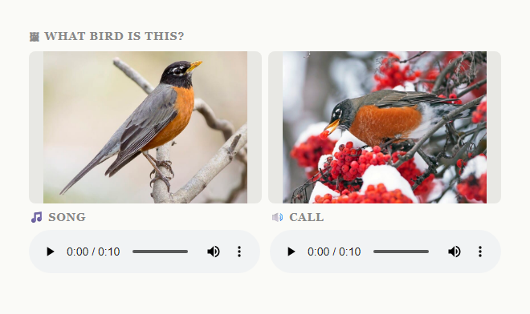
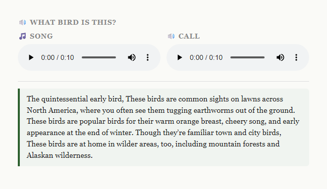
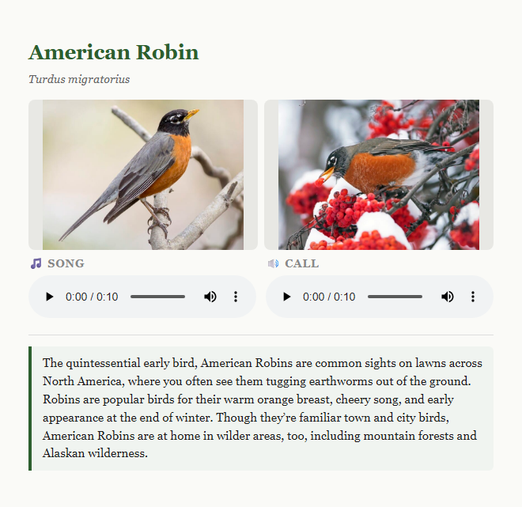

# AviAnki

[](https://pypi.org/project/avianki/)
[](https://pypi.org/project/avianki/)
[](LICENSE)
[](https://github.com/Ian-Costa18/avianki/stargazers)
[](https://github.com/astral-sh/ruff)

Learn to identify the birds in your area. Drop in your location and AviAnki builds a custom Anki deck — sorted by the species most likely to appear near you — pulling photos, calls, songs, and descriptions from [allaboutbirds.org](https://www.allaboutbirds.org).

Each species gets two card types:

- **Photo → Name** — given two photos and audio, identify the bird
- **Description → Name** — given audio and a written description, identify the bird

## Card examples

**Photo → Name** — identify the bird from photos and audio:



**Description → Name** — identify the bird from audio and a redacted description:



**Answer** — reveals the name, scientific name, photos, audio, and full description:



## Prerequisites

- **[uv](https://docs.astral.sh/uv/)** — for running and installing
- **[ffmpeg](https://ffmpeg.org/)** — for trimming audio clips

Install ffmpeg:

```bash
# Windows
winget install ffmpeg

# macOS
brew install ffmpeg
```

## Quick start

1. Go to [allaboutbirds.org/guide/browse](https://www.allaboutbirds.org/guide/browse)
2. Under **Birds Near Me**, enter your city, ZIP code, or state/province — set the time of year to **Year-round** for a complete deck
3. Click **Browse**, copy the URL from your browser's address bar, and run:

```bash
uvx avianki "https://www.allaboutbirds.org/guide/browse/filter/loc/ChIJGzE9DS1l44kRoOhiASS_fHg/..."
```

That's it. An `.apkg` file is written to the current directory — import it into Anki via **File → Import**.

Use `--limit N` to cap the number of species for a smaller file size:

```bash
uvx avianki "https://www.allaboutbirds.org/guide/browse/..." --limit 30
```

## Usage

**From PyPI (recommended):**

```bash
uvx avianki LOCATION [OPTIONS]
```

**From a local clone:**

```bash
git clone https://github.com/Ian-Costa18/avianki.git
cd avianki
uv run avianki LOCATION [OPTIONS]
```

### Location formats

**allaboutbirds.org browse URL** (recommended — species sorted by local frequency, no API key needed):

```bash
uvx avianki "https://www.allaboutbirds.org/guide/browse/filter/loc/ChIJGzE9DS1l44kRoOhiASS_fHg/date/all/behavior/all/size/all/colors/all/sort/score/view/list-view"
```

**Google Place ID** (shorthand for the above):

```bash
uvx avianki ChIJGzE9DS1l44kRoOhiASS_fHg
```

Find a Place ID at [developers.google.com/maps/documentation/javascript/examples/places-placeid-finder](https://developers.google.com/maps/documentation/javascript/examples/places-placeid-finder).

**eBird region code** (species in taxonomic order, requires an API key):

```bash
uvx avianki US-MA
uvx avianki US-MA-017   # county level
```

Get a free eBird API key at [ebird.org/api/keygen](https://ebird.org/api/keygen), then set it in a `.env` file:

```env
EBIRD_API_KEY=your_key_here
```

### Options

| Flag              | Short | Description                                                     |
| ----------------- | ----- | --------------------------------------------------------------- |
| `--limit N`       | `-n`  | Cap the number of species included in the deck                  |
| `--output FILE`   | `-o`  | Output `.apkg` path (default: auto-generated from location)     |
| `--deck-name NAME`| `-d`  | Override the deck name shown in Anki                            |
| `--no-audio`      | `-A`  | Skip downloading call and song audio                            |
| `--no-images`     | `-I`  | Skip downloading photos                                         |
| `--delay SECONDS` | `-D`  | Wait between requests in seconds (default: `0.5`)               |
| `--work-dir DIR`  | `-w`  | Directory for cached media and logs (default: `<tmp>/avianki/`) |
| `--media-dir DIR` | `-m`  | Override media subdirectory (default: `<work-dir>/media/`)      |
| `--ephemeral`     | `-e`  | Use a temporary work dir and delete everything after packaging  |
| `--no-cache`      | `-X`  | Skip cache lookup; delete downloaded media after packaging      |
| `--log-file FILE` | `-l`  | Log file path (default: `<work-dir>/avianki.log`)               |
| `--verbose`       | `-v`  | Show debug-level output in the console                          |
| `--quiet`         | `-q`  | Only show warnings and errors in the console                    |

### Examples

```bash
# Your local birds, capped to 50 species
uvx avianki "https://www.allaboutbirds.org/guide/browse/..." --limit 50

# Custom output path and deck name
uvx avianki "https://www.allaboutbirds.org/guide/browse/..." --output ~/Desktop/MyBirds.apkg --deck-name "My Birds"

# Images only, no audio
uvx avianki "https://www.allaboutbirds.org/guide/browse/..." --no-audio

# Be polite to the server
uvx avianki "https://www.allaboutbirds.org/guide/browse/..." --delay 1.5
```

## Output

An `.apkg` file is written to the current directory (e.g. `Birds_US-MA.apkg`). Import it into Anki via **File → Import**.

Downloaded images and audio are cached in the system temp directory (`<tmp>/avianki/media/` by default, or the directory set by `--media-dir`) so re-runs skip already-fetched files. Re-running the same location only fetches new or missing media. The log is written to `<tmp>/avianki/avianki.log`.

## Notes

- Audio clips are trimmed to 10 seconds via ffmpeg to keep file sizes small.
- allaboutbirds.org browse URLs sort species by likelihood score for your location, which gives much better study order than eBird's taxonomic ordering.
